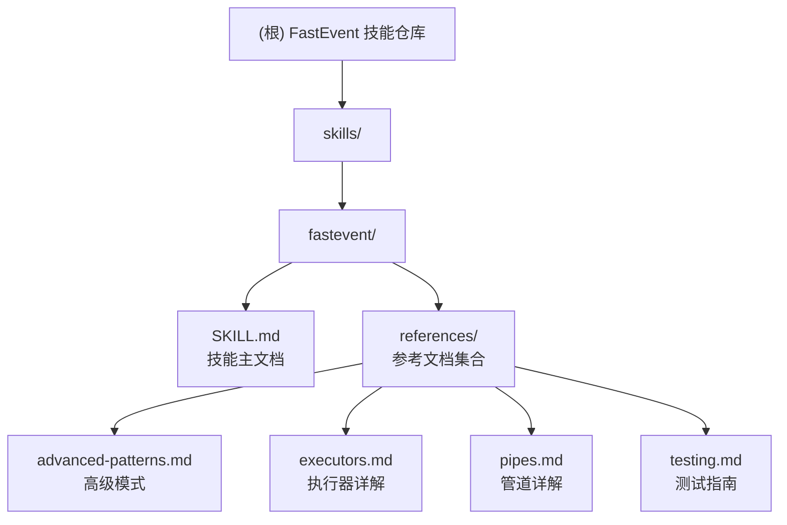

# FastEvent 技能仓库

## 变更记录 (Changelog)

### 2026-03-25 23:00:00
- 新增消息转换功能说明
- 创建 references/transform.md：详细的 transform 参数使用指南
- 更新 SKILL.md：在高级特性中添加消息转换说明
- 更新 references/advanced-patterns.md：添加消息转换简要说明和示例

### 2026-03-25 22:00:00
- 根据 `E:/Work/Code/fastevent/docs/zh` 源文档全面更新技能文档
- 更新 SKILL.md：添加钩子、继承、异步迭代器、元数据、上下文、AbortSignal 等新特性
- 更新 references/executors.md：添加执行次数管理、execute 函数说明等详细内容
- 更新 references/pipes.md：添加更详细的管道说明、组合示例和应用场景
- 更新 references/advanced-patterns.md：添加钩子系统、继承、异步迭代器、上下文、AbortSignal、元数据等高级特性

### 2026-03-25 21:27:44
- 初始化 AI 上下文
- 创建根级 CLAUDE.md
- 创建 skills/fastevent 模块文档
- 建立模块索引与结构图

---

## 项目愿景

FastEvent 技能仓库是一个功能强大、类型安全的事件发射器库的使用指南和参考文档集合。该项目旨在帮助开发者掌握 FastEvent 库的高级特性，包括层级事件、通配符、执行器、管道等，适用于 Node.js 和浏览器环境。

**核心目标**：
- 提供完整的事件驱动开发指南
- 支持类型安全的 TypeScript 开发
- 展示高级模式和最佳实践
- 提供测试策略和示例

## 架构总览

本项目是一个 **文档型技能仓库**，组织结构清晰，包含：

```
skills/
└── fastevent/          # FastEvent 技能模块
    ├── SKILL.md        # 技能主文档（快速开始、核心概念）
    └── references/     # 参考文档集合
        ├── advanced-patterns.md   # 高级模式与最佳实践
        ├── executors.md           # 执行器详解
        ├── pipes.md               # 管道详解
        └── testing.md             # 测试指南
```

**注意**：核心实现代码位于独立的 packages 仓库中（参考 SKILL.md 中的相对路径）。

---

## 模块结构图



---

## 模块索引

| 模块路径 | 职责描述 | 文档类型 | 入口文件 |
|---------|---------|---------|---------|
| `skills/fastevent` | FastEvent 事件发射器库使用指南与参考文档 | 技能文档 | [SKILL.md](skills/fastevent/SKILL.md) |

### 子模块：references/

| 文档名称 | 内容概述 |
|---------|---------|
| [advanced-patterns.md](skills/fastevent/references/advanced-patterns.md) | 高级模式：事件转发、元数据、生命周期钩子、EventBus 模式 |
| [executors.md](skills/fastevent/references/executors.md) | 执行器详解：parallel、series、race、waterfall、random、balance |
| [pipes.md](skills/fastevent/references/pipes.md) | 管道详解：queue、throttle、debounce、timeout、retry、memorize |
| [testing.md](skills/fastevent/references/testing.md) | 测试指南：单元测试、异步测试、通配符测试、覆盖率 |

---

## 核心概念速览

### 事件消息结构
```typescript
{
    type: string,      // 事件名称（支持层级，如 'user/login'）
    payload: any,      // 事件数据
    meta: object       // 元数据（version, timestamp, domain 等）
}
```

### 层级事件与通配符
- `user/*` - 匹配单级（如 `user/login`, `user/logout`）
- `user/**` - 匹配多级（如 `user/profile/update`, `user/settings/theme/change`）
- 支持作用域（Scope）自动添加前缀

### 执行器（Executors）
控制监听器执行方式：
- `parallel()` - 并行执行（默认）
- `series()` - 串行执行
- `race()` - 竞速，返回最快结果
- `waterfall()` - 瀑布流，结果传递
- `first/last/random/balance()` - 其他策略

### 管道（Pipes）
包装监听器实现额外功能：
- `queue()` - 队列处理
- `throttle()` - 节流
- `debounce()` - 防抖
- `timeout()` - 超时
- `retry()` - 重试
- `memorize()` - 缓存

### 类型安全
完整 TypeScript 支持，通过泛型定义事件类型：
```typescript
interface MyEvents {
    'user/login': { id: number };
    'data/update': { value: string };
}
const events = new FastEvent<MyEvents>();
```

---

## 运行与开发

### 查看文档
```bash
# 主文档
cat skills/fastevent/SKILL.md

# 参考文档
cat skills/fastevent/references/advanced-patterns.md
cat skills/fastevent/references/executors.md
cat skills/fastevent/references/pipes.md
cat skills/fastevent/references/testing.md
```

### 相关代码仓库
核心实现代码位于独立的 packages 仓库：
- 核心代码：`packages/native/src/`
- 类型定义：`packages/native/src/types/`
- 测试：`packages/native/src/__tests__/`

---

## 测试策略

### 测试框架
- 使用 Vitest 进行单元测试
- 目标覆盖率：99%+

### 测试类型
1. **基础功能测试**：发布/订阅、事件匹配
2. **异步测试**：`emitAsync`、异步监听器
3. **通配符测试**：单级/多级匹配
4. **执行器测试**：各类执行策略验证
5. **管道测试**：节流、防抖、重试等
6. **类型测试**：TypeScript 类型推导验证

### 测试命令
```bash
# 运行所有测试
bun run test

# 监听模式
npx vitest

# 覆盖率报告
bun run test:coverage
```

### 测试最佳实践
1. 每个测试创建新的 FastEvent 实例
2. 使用 `offAll()` 清理监听器
3. 使用 `emitAsync` 和 `await` 确保异步完成
4. 为 `waitFor` 设置合理超时
5. 保持高覆盖率（99%+）

---

## 编码规范

### TypeScript 规范
- 严格类型检查，使用泛型定义事件类型
- 优先使用 `interface` 定义事件结构
- 避免使用 `any`，使用具体类型或 `unknown`

### 命名约定
- 事件名称使用 `/` 分隔的层级结构（如 `user/login`）
- 监听器函数使用描述性名称
- 常量使用 UPPER_CASE

### 文档规范
- 所有公开 API 必须有 JSDoc 注释
- 示例代码必须可运行
- 使用一致的代码格式

---

## AI 使用指引

### 适用场景
FastEvent 特别适用于以下场景：

1. **跨组件通信**
   - React/Vue 组件间通信
   - 微前端架构下应用间通信
   - WebWorker 消息传递

2. **事件驱动架构**
   - 领域事件处理
   - 工作流引擎
   - 状态机实现

3. **数据流处理**
   - 实时数据更新
   - 表单验证链
   - 数据转换管道

4. **插件系统**
   - 插件生命周期管理
   - 钩子系统
   - 中间件处理

### 关键提示

- **层级事件设计**：合理设计事件层级，利用通配符简化监听
- **执行器选择**：根据场景选择合适的执行策略（竞速用 race、管道用 waterfall）
- **管道组合**：可组合多个管道实现复杂功能（如 debounce + throttle + timeout）
- **错误处理**：`emitAsync` 使用 `allSettled`，单个失败不会中断整体
- **类型安全**：始终定义事件接口，获得完整的类型推导

### 常见模式

1. **EventBus 单例模式**
   ```typescript
   import { EventBus } from 'fastevent/eventbus';
   export const eventBus = new EventBus();
   ```

2. **作用域隔离**
   ```typescript
   const userScope = events.scope('user');
   userScope.on('login', handler);  // 自动添加 'user/' 前缀
   ```

3. **保留事件**
   ```typescript
   events.emit('config/theme', { dark: true }, { retain: true });
   // 新订阅者立即收到最新值
   ```

---

## 相关资源

- **技能主文档**：[skills/fastevent/SKILL.md](skills/fastevent/SKILL.md)
- **高级模式**：[skills/fastevent/references/advanced-patterns.md](skills/fastevent/references/advanced-patterns.md)
- **执行器详解**：[skills/fastevent/references/executors.md](skills/fastevent/references/executors.md)
- **管道详解**：[skills/fastevent/references/pipes.md](skills/fastevent/references/pipes.md)
- **测试指南**：[skills/fastevent/references/testing.md](skills/fastevent/references/testing.md)

---

## 快速参考

### 基本操作
```typescript
import { FastEvent } from 'fastevent';
const events = new FastEvent();

// 订阅事件
events.on('user/login', (message) => {
    console.log(message.payload);
});

// 发布事件
events.emit('user/login', { id: 1 });

// 等待事件
await events.waitFor('user/login', 5000);

// 一次性监听
events.once('startup', handler);

// 移除监听器
const subscriber = events.on('event', handler);
subscriber.off();

// 清除所有监听器
events.offAll();
```

### 高级特性
```typescript
// 作用域
const userScope = events.scope('user');

// 通配符
events.on('user/**', handler);

// 执行器
import { series } from 'fastevent/executors';
const events = new FastEvent({ executor: series() });

// 管道
import { throttle, retry } from 'fastevent/pipes';
events.on('data/update', handler, {
    pipes: [throttle(1000), retry({ times: 3 })]
});

// 保留事件
events.emit('config', { value: 1 }, { retain: true });

// 异步迭代器
for await (const message of events.toIterator('data/update')) {
    console.log(message.payload);
}
```
