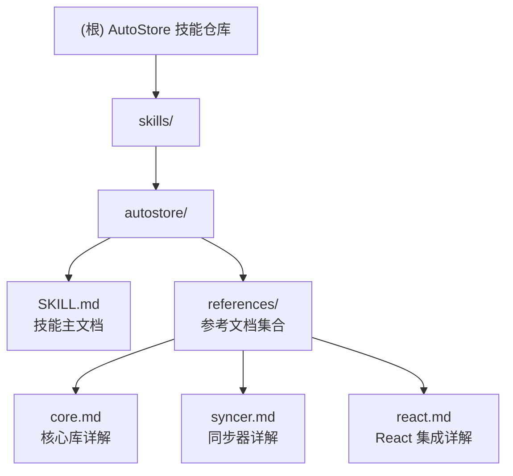

# AutoStore 技能仓库

## 项目愿景

AutoStore 技能仓库是一个功能强大、类型安全的状态管理库的使用指南和参考文档集合。该项目旨在帮助开发者掌握 AutoStore 库的高级特性，包括就地计算属性、异步计算、表单双向绑定、信号组件、状态同步等，适用于 Node.js、浏览器和 React 环境。

**核心目标**：

- 提供完整的状态管理开发指南
- 支持类型安全的 TypeScript 开发
- 展示高级模式和最佳实践
- 提供测试策略和示例

## 架构总览

本项目是一个 **文档型技能仓库**，组织结构清晰，包含：

```
skills/
└── autostore/          # AutoStore 技能模块
    ├── SKILL.md        # 技能主文档（快速开始、核心概念）
    └── references/     # 参考文档集合
        ├── core.md     # 核心库详解
        ├── syncer.md   # 同步器详解
        └── react.md    # React 集成详解
```

**注意**：核心实现代码位于独立的 autostore 仓库中。

---

## 模块结构图



---

## 模块索引

| 模块路径           | 职责描述                               | 文档类型 | 入口文件                              |
| ------------------ | -------------------------------------- | -------- | ------------------------------------- |
| `skills/autostore` | AutoStore 状态管理库使用指南与参考文档 | 技能文档 | [SKILL.md](skills/autostore/SKILL.md) |

### 参考文档

| 文档名称                                           | 内容概述                                           |
| -------------------------------------------------- | -------------------------------------------------- |
| [core.md](skills/autostore/references/core.md)     | 核心库详解：Store 创建、计算属性、状态监听、调试   |
| [syncer.md](skills/autostore/references/syncer.md) | 同步器详解：跨标签页、WebWorker、SharedWorker 同步 |
| [react.md](skills/autostore/references/react.md)   | React 集成详解：Hooks、组件、表单绑定、信号组件    |

---

## 核心概念速览

### 就地计算属性

AutoStore 独有特性，计算结果直接写入状态树：

```typescript
const store = new AutoStore({
  price: 100,
  count: 2,
  total: (scope) => scope.price * scope.count,
});

// total 值直接在 store.state.total 中
```

**依赖自动追踪**：同步计算自动收集依赖，仅依赖变化时重新计算。

### 异步计算

支持 `loading`、`error`、`timeout`、`retry`、`cancel`、`progress` 等高级功能：

```typescript
import { asyncComputed } from "autostore";

const store = new AutoStore({
  userId: 1,
  user: asyncComputed(
    async (scope) => {
      const res = await fetch(`/api/user/${scope.userId}`);
      return res.json();
    },
    ["userId"],
    { initial: null, timeout: 5000 }
  ),
});

// 访问异步状态
store.state.user.value; // 计算结果
store.state.user.loading; // 加载状态
store.state.user.error; // 错误信息
```

### 状态同步

支持多种同步场景：

- **同一进程内**：`store.sync()`
- **跨标签页**：`BroadcastChannelTransport`
- **WebWorker**：`AutoStoreWorkerSyncer`
- **1-N 广播**：`AutoStoreBroadcastSyncer`
- **N-N 同步**：`AutoStoreSwitchSyncer`

### React 集成

提供完整的 React Hooks 和组件：

- `useStore()` - 创建 Store
- `useReactive()` - 响应式状态访问
- `useForm()` - 表单双向绑定
- `<Signal>` - 信号组件，细粒度更新

### 表单双向绑定

强大而简洁的表单绑定：

```typescript
const { state, Form, Field } = useForm({
  email: "",
  password: "",
});

return (
  <Form>
    <Field name="email" type="email" />
    <Field name="password" type="password" />
  </Form>
);
```

---

## 运行与开发

### 查看文档

```bash
# 主文档
cat skills/autostore/SKILL.md

# 参考文档
cat skills/autostore/references/core.md
cat skills/autostore/references/syncer.md
cat skills/autostore/references/react.md
```

### 相关代码仓库

核心实现代码位于独立的 autostore 仓库：

- 核心代码：`E:/Work/Code/sources/autostore/packages/core`
- 同步器：`E:/Work/Code/sources/autostore/packages/syncer`
- React 集成：`E:/Work/Code/sources/autostore/packages/react`
- 官方文档：`E:/Work/Code/sources/autostore/docs/zh/`

---

## AI 使用指引

### 适用场景

AutoStore 特别适用于以下场景：

1. **复杂状态管理**

   - 大型应用的状态管理
   - 跨组件状态共享
   - 嵌套状态管理

2. **表单处理**

   - 复杂表单双向绑定
   - 表单验证
   - 动态表单

3. **状态同步**

   - 跨标签页同步
   - WebWorker 数据同步
   - 多窗口状态共享

4. **响应式 UI**
   - 细粒度更新控制
   - 信号组件优化
   - 性能敏感场景

### 关键提示

- **就地计算**：优先使用计算属性而非监听器
- **异步控制**：充分利用异步计算的高级功能
- **细粒度更新**：使用 Signal 组件优化渲染性能
- **类型安全**：始终定义状态接口，获得完整的类型推导
- **路径匹配**：支持 `*` 单级匹配和 `**` 多级匹配

### 常见模式

1. **创建 Store**

   ```typescript
   const store = createStore({
     user: { name: "Alice" },
     greeting: (scope) => `Hello, ${scope.user.name}`,
   });
   ```

2. **React 组件中使用**

   ```typescript
   function App() {
     const state = useReactive(store);
     return <h1>{state.greeting}</h1>;
   }
   ```

3. **表单双向绑定**

   ```typescript
   const { state, Form, Field } = useForm({
     email: "",
     password: "",
   });
   ```

4. **状态同步**
   ```typescript
   const syncer = store1.sync(store2, {
     mode: "both",
     direction: "both",
   });
   ```

---

## 相关资源

- **技能主文档**：[skills/autostore/SKILL.md](skills/autostore/SKILL.md)
- **核心库详解**：[skills/autostore/references/core.md](skills/autostore/references/core.md)
- **同步器详解**：[skills/autostore/references/syncer.md](skills/autostore/references/syncer.md)
- **React 集成**：[skills/autostore/references/react.md](skills/autostore/references/react.md)

---

## 快速参考

### 核心库基本操作

```typescript
import { AutoStore, computed, asyncComputed } from "autostore";

// 创建 Store
const store = new AutoStore({
  count: 0,
  double: (scope) => scope.count * 2,
});

// 访问状态
console.log(store.state.double);

// 修改状态
store.state.count = 5;

// 同步计算
total: computed((scope) => scope.price * scope.count);

// 异步计算
user: asyncComputed(async (scope) => fetchUser(scope.userId), ["userId"], {
  initial: null,
  timeout: 5000,
});

// 监听状态
store.watch("count", ({ value, oldValue }) => {
  console.log(`count changed from ${oldValue} to ${value}`);
});

// 批量更新
store.batch(() => {
  store.state.count = 1;
  store.state.price = 100;
});
```

### React 集成基本操作

```typescript
import { createStore, useReactive, useForm, Signal } from "@autostorejs/react";

// 创建 Store
const store = createStore({
  count: 0,
  double: (scope) => scope.count * 2,
});

// 在组件中使用
function App() {
  const state = useReactive(store);
  return <div>{state.double}</div>;
}

// 表单绑定
const { state, Form, Field } = useForm({
  email: "",
  password: "",
});

// 信号组件
<Signal $="user.name">{() => <span>{store.state.user.name}</span>}</Signal>;
```

### 状态同步基本操作

```typescript
import {
  AutoStoreWorkerSyncer,
  BroadcastChannelTransport,
} from "@autostorejs/syncer";

// 同一进程内同步
const syncer = store1.sync(store2);

// 跨标签页同步
const transport = new BroadcastChannelTransport({ channelName: "my-channel" });
const syncer = new AutoStoreSyncer(store, { transport });

// WebWorker 同步
const worker = new Worker("./worker.js");
const syncer = new AutoStoreWorkerSyncer(store, worker, {
  mode: "both",
  immediate: true,
});
```
